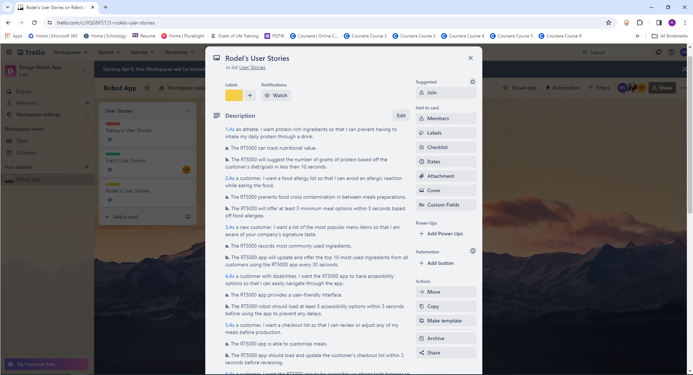
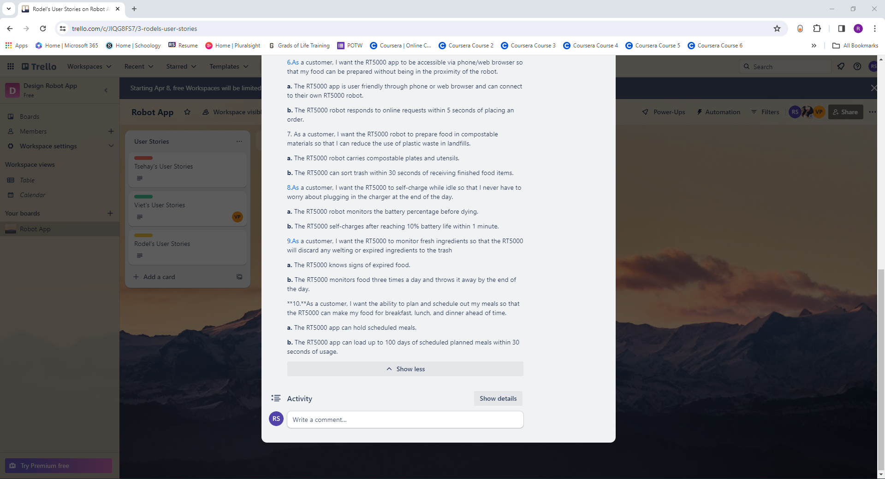

# robot-app
Apply knowledge of the Software Development Life Cycle phases and build an app for a robot

# Interview Questions

## Viet's Questions
1. What temperature does the RT 5000 maintain while cooking chicken soup? 

2. Can users specify the desired level of broth thickness for the chicken soup on the app?  

3. Are there options for users to add herbs or spices to customize the flavor of their chicken soup on the app? 

4. How does the Robo Tasker 5000 handle different cooking times for various ingredients in chicken soup? 

5. Can users choose between different types of chicken (e.g., breast, thigh, or drumstick) for their soup recipe? 

6. What size batches of chicken soup can the RT 5000 prepare at once? 

7. Are there options for users to adjust the cooking time based on their preferred texture for ingredients in the chicken soup? 

8. How intuitive is the user interface of the app for selecting chicken soup recipes 

9. Can users customize the flavors such as saltiness or spiciness in their chicken soup on the app? 

10. Does the RT 5000 app offer different ingredient options for people with diet restrictions?

## Tsehay's Questions
1. What are the key ingredients for a classic tuna fish sandwich?  

2. Can the user define bread preferences or restrictions? 

3. Do consumers want the robot to chop the sandwich in half or quarters?  

4. How should tuna be prepared? Should it be mixed with mayonnaise or other toppings? 

5. Can users add alternative components like lettuce, tomatoes, or pickles?  

6. Can users modify the sandwich with more toppings or spreads? 

7. Should the robot toast bread before creating the sandwich? 

8. Should the robot offer side dishes to the sandwich? 

9. Can users define the quantity of each ingredient to use? 

10. How should the robot present the meal, in a plate or wrap it on a use and throw paper? 

11. Should the robot provide any visual or audio signal while making the sandwich and after finishing the process?

## Rodel's Interview Questions

1.What meat proteins (beef, chicken, fish,boiled eggs, etc.) are available for the customers to add to their salad? 

2.What leafy greens (romaine, spinach, kale, lettuce, etc.) are added to the chef salad? 

3.Do the customers want the option of their salad being tossed with the dressing? 

4.What gluten free options are available for the salad dressings? 

5.Are there different types of salads available for specific food allergies (peanuts, celiac, nut allergies, etc.)? 

6.What toppings (corn, sunflower seeds, chow Mein noodles, almonds, etc.) are available to add to your salad? 

7.Are customers able to add fruit to their salad mix? 

8.Are the leafy greens washed before serving? 

9.Can the RT5000 robot cut food products with a knife?  

10.Is the RT5000 coded to ensure proper Department Of Health Food Safety regulations while serving food? 
    
# User Stories

## Rodel's User Stories

1.As an athlete, I want protein rich ingredients so that I can prevent having to intake my daily protein through a drink. 
- Functional: The RT5000 can track nutritional value. 
- NonFunctional: The RT5000 will suggest the number of grams of protein based off the customer's diet/goals in less than 10 seconds. 

2.As a customer, I want a food allergy list so that I can avoid an allergic reaction while eating the food. 
- Functional: The RT5000 prevents food cross contamination in between meals preparations.  
- NonFunctional: The RT5000 will offer at least 3 minimum meal options within 5 seconds based off food allergies. 

3.As a new customer, I want a list of the most popular menu items so that I am aware of your company’s signature taste. 
- Functional: The RT5000 records most commonly used ingredients. 
- NonFunctional: The RT5000 app will update and offer the top 10 most used ingredients from all customers using the RT5000 app every 30 seconds. 

4.As a customer with disabilities, I want the RT5000 app to have accessibility options so that I can easily navigate through the app. 
- Functional: The RT5000 app provides a user-friendly interface.  
- NonFunctional: The RT5000 robot should load at least 5 accessibility options within 3 seconds before using the app to prevent any delays. 

5.As a customer, I want a checkout list so that I can review or adjust any of my meals before production. 
- Functional: The RT5000 app is able to customize meals. 
- NonFunctional: The RT5000 app should load and update the customer’s checkout list within 3 seconds before reviewing. 

6.As a customer, I want the RT5000 app to be accessible via phone/web browser so that my food can be prepared without being in the proximity of the robot. 
- Functional: The RT5000 app is user friendly through phone or web browser and can connect to their own RT5000 robot. 
- NonFunctional: The RT5000 robot responds to online requests within 5 seconds of placing an order.  

7. As a customer, I want the RT5000 robot to prepare food in compostable materials so that I can reduce the use of plastic waste in landfills. 
- Functional: The RT5000 robot carries compostable plates and utensils. 
- NonFunctional: The RT5000 can sort trash within 30 seconds of receiving finished food items. 

8. As a customer, I want the RT5000 to self-charge while idle so that I never have to worry about plugging in the charger at the end of the day.
- Functional:The RT5000 robot monitors the battery percentage before dying. 
- NonFunctional: The RT5000 self-charges after reaching 10% battery life within 1 minute. 

9.As a customer, I want the RT5000 to monitor fresh ingredients so that the RT5000 will discard any welting or expired ingredients to the trash 
- Functional: The RT5000 knows signs of expired food. 
- NonFunctional: The RT5000 monitors food three times a day and throws it away by the end of the day. 

10.As a customer, I want the ability to plan and schedule out my meals so that the RT5000 can make my food for breakfast, lunch, and dinner ahead of time. 
- Functional: The RT5000 app can hold scheduled meals. 
- NonFunctional: The RT5000 app can load up to 100 days of scheduled planned meals within 30 seconds of usage. 

 

 

## Chicken Soup User Stories:
